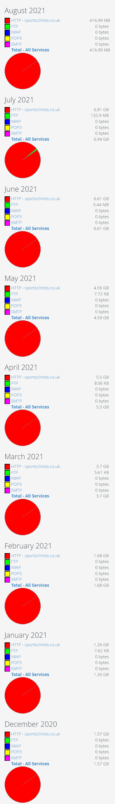

*NB When this page is set to `headless: true` it appears in the main menu above only from this page. See [the docs](https://gohugo.io/content-management/page-bundles/#headless-bundle)*

{ .classit }

## To Do ordered

1. Decide about how to do **images** and set up - no forestry.io working. Do I need Git LFS? Maybe? Images will be added and changed regularly and are most of the site in mb.
2. Figure out how to do **dropdown items** for main menu and how it will work on mobile
3. Set up **Git repo**
4. Find a simple **PWA** tutorial and get a site working with it.
5. The **footer**
   1. check out some examples
   2. decide what goes in it and logical order.
6. Change more pages to markdown using css in attributes 
7. Choose a variable **font** to install.
8. Light colour scheme.
9. **Netlify CMS**

## Interacting technologies

So various technologies to think about using but how will they interact together?

1. CMS. 
   1. Netlify allows Open Auth, open authoring of the site. But this may only work with files in the .FirstSection's of the site. Need to check this out. 
   2. Forestry only allows on image (or prob one asset) folder. No good for leaf bundles esp if you want to use Hugo image processing.
2. Git LFS makes sense and must be used with Netlify Large Media which seems good. But does this work with Netlify CMS and Open Auth?
3. PWA & Service Workers

## Basic heirarchy { .firstheading }

Region > Area > Crag > (topos)

So the menu item on the second cragnav menu is for the area.

## Menu's

The main menu is areas: 
- peak
- yorkshire
- N Wales
- S Wales
- South Coast (or devon & dorset)
- Scotland
{.firstTryList}

Other site sections or pages: 

- **home pag**e
- **about** - could go on the home page
- **updates & news** - could go on the home page
- blog, more of the above. A blog section could be used for everything else. Some things could be 'sticky' at the top like *How to Contribute*. They could also be directly linked to the home page, the footer etc.
- **contact** - link in footer and elsewhere
- **how to contribute**
- **5000 route list**
- **bolt fund**
- **Harpur Hill and other guides** - shop?
- **Notes** - a hidden section for reference (like this page).

## Drop down menus

The main regions could then acces the different areas directly. This is important since the addition of areas means an extra click to reach a crag. How would this work on mobile touch screens? Touch once for the dropdown and touch again to get the regional page?

### Types of page

The main kind of pages are these. Though that doesn't mean they need separate templates. Adding the `section` and `type` as `<body>` classes might be helpful at some point.

1. Region
2. Area
3. Crag
4. Topo

## Maps and map pages?

Maps can be easily added to pages from the frontmatter, so easy in fact it might be good to have a map for every crag. However this would be more bandwidth and slower download times (Is there a limit to map requests from Leaflet.js?). Might be better to have a specific map/approach/getting there page for this?

## Search bar

Fairly high priority, users expect this and a quick way to look for a crag.

Algolia, Duckduckgo embedded in an iframe, 

## CMS

How hard is it to self host Netlify CMS? Then have unlimited users.

Can we use multiple CMS's? Might be confusing?

How much does it cost to add users? How much hosting cost with Netlify? How much with Cloudflare?

## Change Name

Could change the name to Sport Climbs .co.uk. This is more commonly used so if someone cannot remember the name this is more likely to be searched for. Could use both, at least for a couple of years

## Graphs with number of routes

Each crag home page has a graph listing the number of route in 

    5s, low 6s, hi 6s, lo 7s, hi 7s, lo 8s, hi 8s, lo 9s

This could be stored in a frontmatter array: `gradegraph: [0, 0, 3, 6, 10, 10, 1, 2]`

## Open Source

Invite other climbers to contribute. If UKC can get volunteers then surely we can get volunteers for a non-profit site.

Contribute info via a form and/or email. For more tech savvy use GitHub. For some a CMS / CMS's

## Images w Hugo

Automate image sizing using Hugo and a shortcode using `srcset`. For this to work images need be either in a *page bundle* or stored in the `resources/assets/img` folder.

A main page image could be added to the frontmatter: `pageimage: charlton-chestwig-on-revelations`

Topo images could be added using a naming convention like `hh-racetrack-topo-1.jpg`. If stored in a leaf bundle it should be possible to easily. Or, in a leaf bundle they would just be called `topo-1.jpg` etc. though this would give no info about the file. Info could be stored in meta data

## Images w/out Hugo

Another way to store image is using an LFS (large file service). Worth noting that most of the site is images: 132mb out of a total of 135!!!

Git has LFS incorporated to it and these services (at least Netlify) make use of that.

There are several options:

- Commit Media to Repository
- Cloudinary (beta) - up to 40gb pcm last time I checked
- Amazon S3
- Netlify Large Media - up to 100gb pcm then £20 per additional 100gb (cheaper to sign up to Netlify Pro account for $19 and get 400gb pcm).
- GitLab LFS - the two probs with with GitLab is it's less likely to get collabs and I don't think Forestry works with them.

If bandwidth is a concern then maybe use Cloudflare with it's unlimited bandwidth instead. Other factors include build time. Currently the site takes around 15s at home. More pages etc. will increase this so let's say 30s. Two updates per day would be 30 minutes per month.

**HOWEVER:** checking the 123-reg stats shows that the maximum used per month so far is only **6.81gb**. If the site/app becomes really successful this could jump up significantly but still a ways up to 100gb. If the site can be changed to a progressive web app that should limit bandwidth even more.

## Route grade and description

The whole route could be set in a a grid box with the following elements:

- Route name
- grade
- stars
- year
- description
- first ascentionist

This could be stored in a data file with same path as page plus `topo-1`, `topo-2` etc..

This would not be too hard to set up but a lot of work to change everything over. Volunteers ?

## Weather app


Embed a weather app to every area or crag page. The area covered would need to be stated, perhaps in the frontmatter, otherwise using the section name.

`weather: millers dale`

### Some OK-ish widgets

Generally these don't offer enough details. Hour by hour would be good.

- Met Office - perhaps the most reliable, a known name, making it more useful
- [Elfsight](https://elfsight.com/weather-widget/) - looks like one of the best. Highly customizable.
- [Forecast.co.uk](https://www.forecast.co.uk/widget/) - custom colours, limited fonts? Small text
- [Meteored](https://www.theweather.com/widget/) - custom colours and icons
- [booked.net](https://www.booked.net/?page=weather_widget_customize&type=4&cityID=3540&cmetric=1#)

### Or Open Weather API

- [Open Weather Map API](https://openweathermap.org/) looks good but would be far more complicated, writing CSS, designing it, getting using icons etc. Probably at least a days work, maybe more. One for the future (not urgent)

## Add premade info boxes

Add pre set warnings through the frontmatter.

`nesting: April 1st to 25 June`

`loose: Caution some loose rock on the top of routes 10, 11 and 12`

`rebolted: [June 21, Gary Gibson]`

## Add BMC information

Can this be accessed directly? Via an API or how?

## Better responsive menu system

Add a JS sliding type of menu from a hamburger. Though this might be too much for the regional links, considering most people will be looking for a crag immediately (another click).

## PWA's

Make each crag a downloadable progressive web app, so they can be accessed offline.